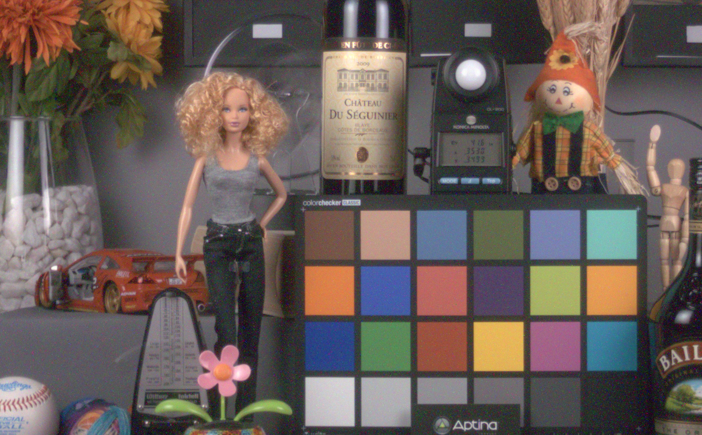
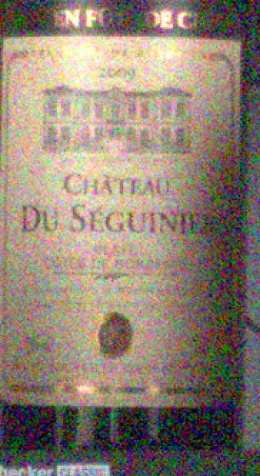
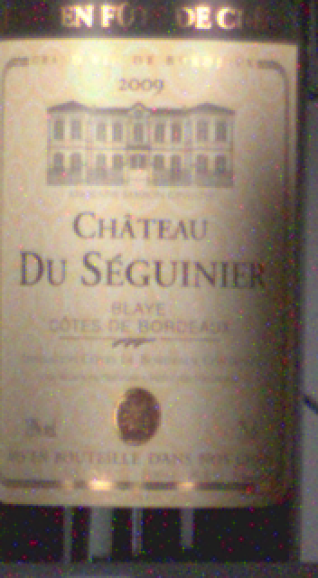

Belka - A Camera Raw Image Processing Pipeline
====================================

This project is a C++/OpenCL implementation of the camera ISP:
- black level adjust
- white balancing
- noise reduction
- green balancing
- [demosaicing](https://en.wikipedia.org/wiki/Demosaicing)
- color correction matrix
- point filter
- gamma encoding
- yuv conversion

The code is checked against GNU C++ compiler on desktop and Android toolchain. The test harnes supports only RAW input and BMP output. The OpenCL kernels are in the `kernels` folder. Qualcomm OpenCl library (Linux/Android) is in folder: `libs`.

Run on MacOSX
------------
- Download [raw data file](https://www.dropbox.com/s/jb9ufk2ybkya5po/test1.zip?dl=0) (~1GB):  
```
    1.3 sec (404 frames 1920x1080, 12bit) of raw RCCB sensor video taken at low light conditions  
``` 
- unzip to the project directory (will create `test1` folder) 
- `make tv` 
- to control noise reduction use `[cmd]+` and `[cmd]-` 

Run on Android
--------------

#### OpenCL on Android
 - [ ] Set `ANDROID_NDK` to the NDK location on your computer: `export ANDROID_NDK=~/<project>/android-ndk-r9`
 - [ ] Set `ANDROID_HOME` to the SDK location: `export ANDROID_HOME=~/<project>/adt-bundle-linux-x86_64-20130917/sdk`
 - [ ] Change `AndroidManifest.xml` to target the SDK you have, such as: `android:targetSdkVersion="18"`
 - [ ] Change `project.properties`  accordingly: `target=android-18`
 - [ ] *Do not* use `android update project --name Rccb --path . --target 1` because it kills some existing targets of the project in `build.xml`.

#### Buiding and deploying
---------------------
* To clean: `ndk-build clean` or `ant clean`
* To build the JNI: `ndk-build` or use `ant jni`.
* To install the native part of the application:`make adb-install`
* To do everythig at once: `ant jni debug install run`
* To run the OpenCL code on the platform and get the image back:`make adb-run`

Benchmarks
-----------
```
MacbookPro : 1920x1080 12bits : 5.3ms / frame
           : 4016x3016 12bits : 24.4ms / frame 
```      

[] []
[] []

Links
-----
#### Belka and Strelka
[](https://www.youtube.com/watch?v=u4SUH9qITxE "Белка и Стрелка")
*Animal heroes. They were instrumental in the future of human space fligh.*

#### Chewbacca
[](https://youtu.be/-4hssVGcoLs?t=44m17s)

#### R2-D2
[](https://youtu.be/9gTs1OL1jrQ?t=30m47s)


